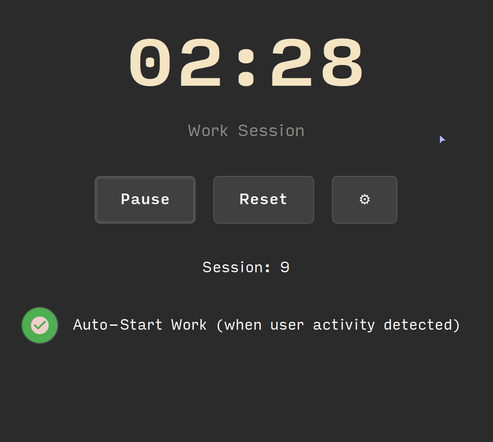
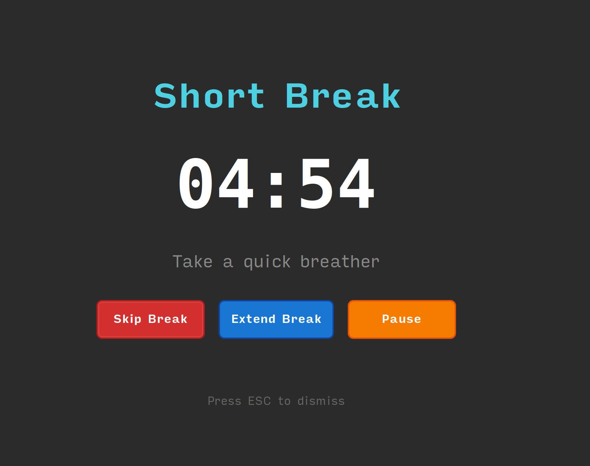
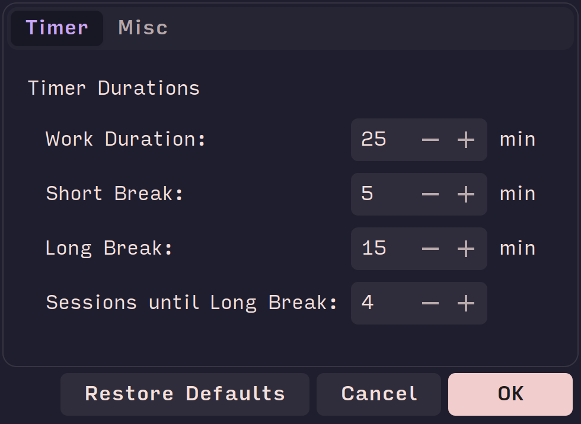

# Commodoro

A fast, native C/GTK3 Pomodoro timer for Linux with comprehensive desktop integration.

## Screenshots

<p align="center">
  
  
</p>
<p align="center">
  
  
</p>

## Features

- **Pomodoro Timer**: 25-minute work sessions with 5-minute breaks (configurable)
- **System Tray**: Live countdown with progress arc and state colors
- **Break Overlays**: Full-screen break notifications 
- **Auto-Start**: Detects user activity to start work sessions (optional)
- **Idle Detection**: Auto-pause when idle, auto-resume on activity (optional)
- **Dark Theme**: Modern GTK3 interface optimized for focus
- **Audio Alerts**: Built-in chimes for all timer events
- **Configuration**: Persistent settings in `~/.config/commodoro/`

## Quick Start

```bash
# Install dependencies (Ubuntu/Debian)
sudo apt install libgtk-3-dev libgstreamer1.0-dev libxtst-dev libxss-dev

# Build and run
make clean && make
./commodoro
```

## Usage

```bash
./commodoro                   # Standard 25/5/15 minute intervals
./commodoro 5s 3s 2 4s        # Test mode: 5s work, 3s break, 2 sessions, 4s long break
./commodoro --log-level DEBUG # Debug logging
```

**Time units**: `s` (seconds), `m` (minutes), `h` (hours), no suffix = minutes

## System Tray

- **Gray (●)**: Ready/Idle
- **Red**: Work session with countdown and green progress arc
- **Green**: Break sessions with countdown and red progress arc
- **Yellow (||)**: Paused
- **Progress Arc**: Fills clockwise during sessions with inverse colors

## Keyboard Shortcuts

### In-App Shortcuts

- **Space**: Start/Pause timer
- **Escape**: Hide to system tray

### Global Shortcuts

You can create global shortcuts by binding the [command-line commands](#global-shortcuts--d-bus) to a key combination in your desktop environment's system settings.

## Global Shortcuts & D-Bus

Commodoro can be controlled from the command line, allowing you to create global keyboard shortcuts using your desktop environment's settings (e.g., MATE/GNOME Keyboard Shortcuts).

### Commands

The application acts as a client to send a command to a running instance.

- `commodoro toggle_timer`: Starts, pauses, or resumes the timer.
- `commodoro reset_timer`: Resets the timer to the first session.
- `commodoro toggle_break`: Skips the current work/break phase and starts the next one.
- `commodoro show_hide`: Toggles the main window's visibility.

If the application is not running, you can use the `--auto-start` flag to launch it first:

```bash
# Example: Toggle the timer, launching Commodoro if it's not running
commodoro toggle_timer --auto-start
```

This is ideal for binding to a global hotkey.

### D-Bus Interface

For advanced scripting, Commodoro exposes the following D-Bus interface on the session bus:

- **Service:** `org.dl.commodoro`
- **Object Path:** `/org/dl/commodoro`
- **Interface:** `org.dl.commodoro.Timer`
- **Methods:**
  - `ToggleTimer()`
  - `ResetTimer()`
  - `ToggleBreak()`
  - `ShowHide()`
  - `GetState()` (returns the current timer state as a string)

## Audio Features

- **Built-in Chimes**: Different tones for each timer event
- **Event Sounds**: Work start, break start, session complete, timer finish
- **Idle Notification**: Gentle chime when pausing due to idle
- **Enable/Disable**: Global sound toggle in settings
- **Volume**: Fixed at 70% for optimal clarity

## Settings

- **Timer Durations**: Work (1-120 min), Short Break (1-60 min), Long Break (5-120 min)
- **Sessions**: Number of work sessions before long break (2-10)
- **Auto-Start Work**: Begin work automatically when activity detected after break
- **Auto-Pause on Idle**: Pause timer when idle for timeout period (1-30 min)
- **Sound Alerts**: Enable/disable audio notifications

## Architecture

**Core Components**: Timer state machine, GTK3 GUI, system tray integration, GStreamer audio, input monitoring, XScreenSaver idle detection, persistent configuration

**Clean C99**: Modular design with proper memory management and error handling

## Known Issues

- **Break Overlay Dialog Stacking**: Some applications/dialogs can still appear above the fullscreen break overlay despite `gtk_window_set_keep_above()` and `gtk_window_stick()`. This appears to be a limitation of GTK3 window management on certain desktop environments. Future solutions may require platform-specific approaches like X11 override-redirect windows or compositor-specific hints.

## Contributing

See `CLAUDE.md` for development guidelines and project structure.
